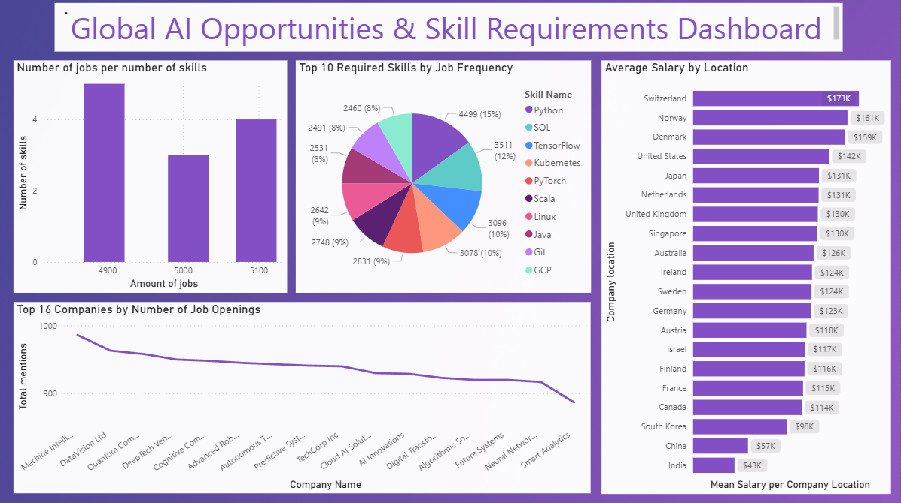

# AI Jobs Market — Database Design & BI Dashboard

End-to-end data project: raw CSV → normalized PostgreSQL database → SQL Server migration → Power BI dashboard.



## What this project does

Takes a flat 15,000-row AI jobs dataset and builds a proper relational database from scratch, then analyzes it with SQL and visualizes the results in Power BI.

**Pipeline:**
```
ai_job_dataset.csv
    ↓ 01_load_raw.py        (Python + psycopg2)
PostgreSQL — ai_jobs (raw table)
    ↓ 02_normalize.sql      (SQL normalization)
PostgreSQL — companies / jobs / skills / education
    ↓ 03_queries.sql        (analysis queries)
Insights: top skills, salary by country, hiring volume
    ↓ 04_sqlserver_migration.sql
SQL Server — full schema + data
```

## Schema

```
companies         jobs              skills          education
───────────       ──────────────    ──────────      ─────────────
company_id (PK)   job_id (PK)       skill_id (PK)   education_id (PK)
company_name      job_title         job_id (FK)     job_id (FK)
company_size      salary_usd        skill           education_required
company_location  experience_level
                  employment_type
                  remote_ratio
                  industry
                  company_id (FK)
                  posting_date
```

The original `ai_jobs` table is kept as-is for reference. The normalized tables are derived from it.

## Key SQL concepts used

- `SERIAL` / `IDENTITY` for auto-increment primary keys
- `REFERENCES` for foreign key constraints
- `DISTINCT` to deduplicate companies on insert
- `unnest(string_to_array(...))` to split comma-separated skills into rows
- CTEs (`WITH`) for multi-step analysis queries
- Window functions (`LAG`, `OVER`, `PARTITION BY`) in the fraud detection pattern
- `GROUP BY` + `HAVING` to find duplicates
- `JOIN` across normalized tables for reporting

## Dashboard highlights (Power BI)

- Top 10 most required skills by job frequency
- Average salary (USD) by company location
- Top 16 companies by number of job openings
- Distribution of jobs by number of required skills

## Tech stack

| Layer | Tool |
|---|---|
| Raw ingestion | Python, psycopg2, pandas |
| Database | PostgreSQL 13 (Docker) |
| Normalization & analysis | SQL |
| Migration | SQL Server 2022 (Docker), T-SQL |
| Visualization | Power BI |
| Infrastructure | Docker, Docker Compose |

## How to run

### 1. Start PostgreSQL

```bash
cd docker
docker-compose up -d
```

### 2. Load raw data

```bash
pip install pandas psycopg2-binary
python sql/01_load_raw.py
```

### 3. Normalize

Connect to the database and run:

```bash
psql -h localhost -U postgres -d postgres -f sql/02_normalize.sql
```

### 4. Run analysis queries

```bash
psql -h localhost -U postgres -d postgres -f sql/03_queries.sql
```

### 5. Migrate to SQL Server (optional)

Start SQL Server container, create `job_market` database, then:

```bash
sqlcmd -S localhost,1433 -U SA -P 'YourPassword' -d job_market -i sql/04_sqlserver_migration.sql
```

## Dataset

- Source: Kaggle (free license)
- 15,000 rows, 20 columns
- Fields: job title, salary (USD + local currency), experience level, employment type, remote ratio, required skills, education required, company info, posting dates
